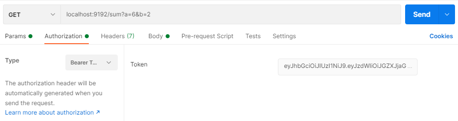

# IS_HT3_MATH
hoja de trabajo 3, ingenieria de software, rest api, operaciones aritmeticas validando un JWT

## requirements
Use this proyect for get a valid JWT
https://github.com/FernandoSicay/IS_HT3_AUTH

## documentation

## How to run ?
-   First: Download the proyect
-   Second: use maven to package the proyect. `mvn package`
-   Third: execute the jar file `java -jar target/IS_HT3_MATH-v1.jar`

## how to use?
In this case we will use postman to get the http request
- Remember to have a valid JWT, you can get it by reading the [requirements](#requirements) part.
- open postman
- end points 
    `localhost:9192/div?a=6&b=2` 
    `localhost:9192/mult?a=6&b=2` 
    `localhost:9192/sum?a=6&b=2`
    `localhost:9192/sub?a=6&b=2`
  
- Go to the "authorization" tab, choose the type "bearer token" and fill the token field with the valid JWT

- example

#### Fernando Sicay